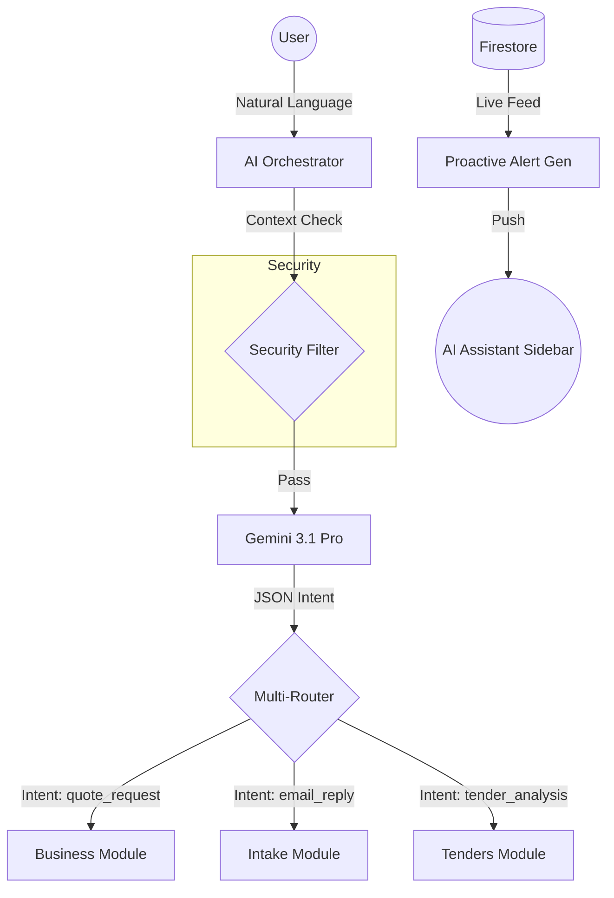

# BIM BOS AI Orchestration Specification

## 1. Context Management Schema (JSON)

### User Context
```json
{
  "role": "boss | sales",
  "company_id": "string",
  "permissions": ["string"],
  "active_module": "DASHBOARD | INTAKE | BUSINESS | REPORTING | TENDERS"
}
```

### Conversation Memory
```json
{
  "session_id": "uuid",
  "entities_extracted": [
    { "type": "client | date | value | project", "value": "any", "confidence": 0.95 }
  ],
  "module_handoffs": [
    { "from": "INTAKE", "to": "BUSINESS", "timestamp": "ISO8601" }
  ]
}
```

### Business Context Cache
```json
{
  "key_accounts": [],
  "active_tenders": [],
  "pending_quotes": []
}
```

## 2. Exact LLM Prompts

### Intent Routing Prompt
```text
Act as the Central AI Orchestrator for BIM BOS.
    
SYSTEM CONTEXT:
User Role: {{role}}
Active Module: {{activeModule}}
Memory: {{memory}}

USER REQUEST: "{{message}}"

TASK:
Classify user intent: [email_reply|task_create|meeting_schedule|quote_request|tender_analysis|account_register|report_request].
Extact relevant entities.

GUIDELINES:
- Role Sensitivity: If 'sales', restrict financial aggregates.
- Routing: Return the target module for handoff.

Format: JSON with {intent, confidence, entities, targetModule, explanation}.
```

### Proactive Alert Generator Prompt
```text
Act as a proactive Business Advisor for isBIM BOS.
Review the following state and generate 3 prioritized alerts.

BUSINESS STATE:
Accounts: {{accounts}}
Tenders: {{tenders}}
Quotes: {{quotes}}

Format: JSON array of [{title, body, action_url, priority:1-5}]
```

## 3. Data Flow Diagram (Mermaid)



## 4. Security Enforcement
- **Isolation**: Every AI query is wrapped with `company_id` filter in the system instruction.
- **Audit**: All `IntentResponse` objects are logged with `auth.uid` and `original_prompt`.
- **Role-Based Filtering**: The orchestrator prompt explicitly changes the "Level of Detail" based on the `role`.
